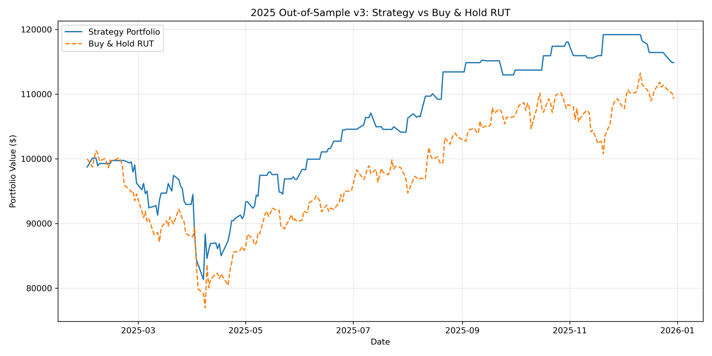

# Russell Reconstitution Trading Strategy

Every June, FTSE Russell reshuffles its indexes. Companies that outgrew the Russell 2000 move out, smaller ones move in, and every fund that tracks the index has to make those trades by the effective date, whatever the price. The preliminary lists come out in late May, so anyone can see the buying and selling coming weeks ahead.

I built this as a research project for a summer trading competition. The question was whether that predictable flow leaves a footprint in prices, and whether the broader market backdrop changes how much you should trust it. It covers two things: a daily brief for the June 26, 2026 reconstitution, and a backtest of past years. None of it is investment advice, and the results are backtests, not live trading.

## What's in here

There are two pieces that look at the same event from different angles.

The first is a daily pipeline in `live_pipeline/`. It pulls a handful of market series from Yahoo Finance (the Russell 2000, S&P 500, VIX, Treasury yields, the dollar, gold and oil), builds 21 features from them, and feeds those to a LightGBM model trained on 2010 through 2024 to guess the next day's direction for the Russell 2000. That guess goes into a simple regime filter that calls the market bullish, neutral or bearish and trims position size when conditions look weak, with a hard stop if the index drops 8% over 30 days. Alongside the model, the pipeline scores the May 2026 preliminary additions and deletions on momentum, market cap and trading volume. The idea is that the smallest names have the most forced buying relative to how much stock normally trades. Everything ends up in a plain text brief.

The second is a historical study in `historical_study/`. It goes back through earlier reconstitutions and measures what happened around each one: the run-up in additions, the reversal afterward, where VIX and the yield curve stood, and how outcomes split across bull, bear and neutral years. It runs in parallel with joblib and also includes a Monte Carlo run on position sizing and a preview of December 2026, which will be the first semi-annual reconstitution.

## A quick check on the model

To make sure the pipeline holds together end to end, I ran the trained classifier over 2025, a year it never saw in training. It held a full position on bullish signals, half on neutral ones and nothing on bearish ones. The chart below is gross of costs.



Over that year the strategy finished around 114.9k from a 100k start, while simply holding the index finished around 109.3k. That is a gross return of 14.9% against 9.3% for buy and hold, before any trading costs.

The strategy changed position 72 times in 230 trading days, about 79 units of one-way turnover (a unit is a full move between flat and fully invested), so costs matter. I repriced the saved daily positions with a flat cost per unit traded, applied on each position change, with cash earning nothing:

| Cost per unit traded | Net return | Sharpe | Net vs buy and hold |
|---|---|---|---|
| 0 bps | 14.9% | 0.87 | +5.6 pts |
| 2 bps | 13.3% | 0.79 | +3.9 pts |
| 5 bps | 10.8% | 0.67 | +1.5 pts |
| 10 bps | 6.9% | 0.48 | -2.4 pts |

The edge over buy and hold disappears at about 7 bps per unit traded, and the return itself reaches zero near 19 bps. Those cost levels are assumptions, not measured spreads. I did not model spread, impact or fills from real quotes. It is also one year, tested once, so I treat it as a sanity check on the code and not as evidence that the approach works.

## Running it

```bash
python -m venv .venv && source .venv/bin/activate
pip install -r requirements.txt
```

Each folder is meant to be run from inside itself, since paths are relative. No API keys are needed. Data and trained models are not stored in the repo, so you rebuild them first:

```bash
cd live_pipeline
python archive/data_pull_full.py   # writes data/master_features.csv (2010-2024)
python train_model.py              # writes models/lgbm_classifier.pkl and lgbm_regressor.pkl
python validate_2025.py            # the 2025 run shown above
python main.py                     # daily brief -> backtests/daily_brief.txt
```

```bash
cd historical_study
python run_all.py                  # backtest, per-ticker models, Monte Carlo, December preview
```

The candidate lists in `live_pipeline/russell_candidates_2026.py` are the 2026 preliminary lists, hard-coded. Swap them out to look at another year. `generate_report_2026.py` makes a PDF version of the brief using `reportlab`.

```
live_pipeline/
  daily_update.py             features and signal for the latest day
  train_model.py              trains the classifier and regressor
  validate_2025.py            out-of-sample run for 2025
  russell_candidates_2026.py  scores additions and deletions
  june_recon_overlay.py       regime and hard-stop logic
  main.py                     full pipeline and daily brief
  dashboard.py                terminal dashboard
  predict_2026.py             2026 predictions
  archive/                    earlier data pulls, feature builds and tuning
historical_study/
  scripts/                    backtest, per-ticker models, Monte Carlo, December preview
  run_all.py                  runs all four steps in order
  results/                    summaries and CSVs from the last run
docs/                       figures used in this README
```

## What I take from it

The most useful thing here is the routine itself. The reconstitution gives you a known date, a public list of names and a mechanical reason for price pressure, and the code turns that into something repeatable: score the candidates, size by market regime, cap the downside. Pointing it at the next reconstitution mostly means updating the lists.

The model is better read as one input to the regime filter than as a standalone signal. The 2025 run shows the pipeline works end to end. It does not show an edge.

I have since corrected one labeling bug in the historical study's data pull (see below), but I have not audited the rest of that code. Before leaning on any of it again I would review the study end to end and test the model walk-forward across several years with costs included. December 2026 is a natural first target, since the same screen applies to the first semi-annual reconstitution.

## Known problems

I would rather list these than have the numbers read as more than they are.

I found and corrected a labeling bug in the historical study. That is the only defect I have verified and fixed, and I have not audited the rest of the study. The download script gave each Yahoo Finance series its name by position, but Yahoo returns the columns in alphabetical order, so every series carried the wrong label. The "VIX" column was gold, the "Russell 2000" column was crude oil, and the "yield curve" was the S&P 500 minus a bill rate, which is why VIX read in the hundreds and the spread in the thousands. The earlier backtest was therefore measuring oil, not the index. The script now selects columns by ticker name. VIX runs from about 9 to 83 and the yield spread from about -1.7 to 3.9 points, both in plausible ranges, which is a sanity check and not proof that nothing else is wrong. An earlier version of this README blamed a unit mismatch between `^TNX` and `^IRX`. That was wrong, since both are quoted in percent. The spread is the 10-year yield minus the 13-week bill, not a 10-year minus 2-year spread as some code comments say.

After that correction the study covers 26 consecutive years, 2000 through 2025. The index rose on average 0.76% from the preliminary list date to the effective date (it was reported as 1.66% before the fix), was up in 16 of 26 years, and has a t-statistic of 0.9, which is not distinguishable from zero. The old "Sharpe proxy" of 5.5 was the sum of the annual numbers divided by their standard deviation, not a Sharpe ratio, so the summary now reports the t-statistic instead. Other limits remain. The "edge" is the return of the Russell 2000 index over that window, not a trade in the added or deleted names, so the study does not measure the reconstitution effect itself. And the bull, bear and neutral split is defined by the index return over the 60 days ending on the effective date, which overlaps the window being measured. The gap between bull years (+3.2%) and bear years (-4.8%) is therefore partly built in and should not be read as a tested filter.

The Monte Carlo draws from hand-set expected returns and volatilities for each trade bucket (see `monte_carlo.py`) on a notional $1,000,000, so its output reflects those assumptions and not realized trading.

The classifier trains on 2010 to 2024 with no separate validation split, which makes the 2025 run the only held-out test. The simulation itself models no transaction costs, borrow costs or market impact, and the cost table above is a repricing of saved positions, not a rerun with a cost model.

The cost problem is larger for the candidate trades than for the index-level run. The model trades the index, which is cheap to execute through a liquid ETF or futures. The additions and deletions are small and micro caps, where a round trip (spread plus market impact, plus borrow on shorts) can plausibly cost 1% to 3%. That is the same size as the 1.1% to 2.0% per-trade edges hard-coded into the Monte Carlo. No backtest of those baskets exists, so whether any edge survives costs is untested. Until it is tested net of realistic costs, the candidate trades should be read as unproven.

The 2022 to 2023 equity curve I had saved is not shown. It sits inside the 2010 to 2024 training window, so it is in-sample. It also shows only about a 1% gross gain over two years, which costs would remove at a few basis points. And the candidate lists are tied to the June 26, 2026 reconstitution.

## Related

I also have a separate project on the variance risk premium (VIX against forward realized volatility) that lives outside this repo.
